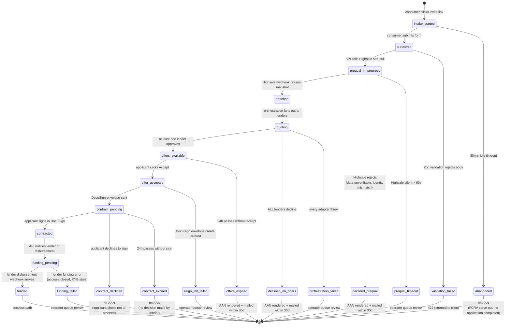

# Application state machine

Every Application row sits in exactly one state at any moment. State is
the source of truth. Every transition writes an immutable row to
`audit_outbox` — the hash chain proves no transition was retroactively
edited or skipped.

The machine is encoded in [`services/application/src/state-machine.ts`](../../services/application/src/state-machine.ts)
as XState v5. This diagram is the Mermaid rendering of that machine.
**When the code changes, edit this diagram in the same PR.**

## Reading the states

| State                  | Means                                                   | Terminal? | AAN required?                                  |
| ---------------------- | ------------------------------------------------------- | --------- | ---------------------------------------------- |
| `intake_started`       | Consumer has the apply page open but hasn't submitted   | No        | —                                              |
| `submitted`            | Form posted, Application row created, awaiting Highsale | No        | —                                              |
| `prequal_in_progress`  | Soft-pull request in flight                             | No        | —                                              |
| `enriched`             | Highsale snapshot received, ready to orchestrate        | No        | —                                              |
| `quoting`              | Lenders being queried in parallel                       | No        | —                                              |
| `offers_available`     | One or more offers ready for applicant to pick          | No        | —                                              |
| `offer_accepted`       | Applicant chose an offer                                | No        | —                                              |
| `contract_pending`     | DocuSign envelope sent, awaiting signature              | No        | —                                              |
| `contracted`           | Loan agreement signed                                   | No        | —                                              |
| `funding_pending`      | Lender notified, awaiting disbursement                  | No        | —                                              |
| `funded`               | Money on its way to the merchant                        | **Yes**   | No                                             |
| `declined_prequal`     | Highsale rejected at soft-pull stage                    | **Yes**   | **Yes**                                        |
| `declined_no_offers`   | All lenders declined after quote                        | **Yes**   | **Yes**                                        |
| `offers_expired`       | Offers sat for 24h with no accept                       | **Yes**   | **Yes**                                        |
| `contract_expired`     | DocuSign envelope expired without signature             | **Yes**   | No (lender approved; applicant didn't proceed) |
| `contract_declined`    | Applicant declined to sign                              | **Yes**   | No                                             |
| `abandoned`            | Consumer never submitted                                | **Yes**   | No (FCRA carve-out)                            |
| `validation_failed`    | Form failed server-side validation                      | **Yes**   | No                                             |
| `prequal_timeout`      | Highsale never returned                                 | **Yes**   | Operator review                                |
| `orchestration_failed` | Every lender adapter threw                              | **Yes**   | Operator review                                |
| `esign_init_failed`    | DocuSign API errored                                    | **Yes**   | Operator review                                |
| `funding_failed`       | Lender couldn't fund (account closed, etc.)             | **Yes**   | Operator review                                |

## Invariants

- **Only forward transitions.** No state ever moves backward. A `funded` Application cannot un-fund. To reverse, create a new Refund record (state machine in `services/payment`).
- **Atomic with audit.** Every transition is wrapped in a single `prisma.$transaction` that updates the Application AND inserts the audit row. Either both happen or neither.
- **Idempotent.** Each transition has a guard that no-ops if the target state is already reached. Repeated webhooks don't double-transition.
- **Bounded retries.** The webhook dispatcher retries each delivery up to 12 times with exponential backoff before marking it `dead_letter`. Operator gets an alert.
- **No silent transitions.** Every state change has a NAMED action (`application.submitted`, `application.contracted`, etc.) in the audit row. No `state_change` catchall.
