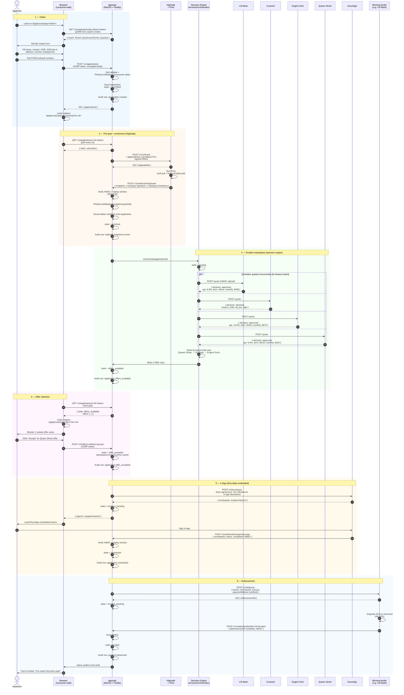

# Consumer application flow — end-to-end

The headline diagram. Walks from "applicant clicks the link a coach
sent them" through "lender disburses funds to the coach's business
account."

**Latency budget:** intake submit → offers visible ≤ **8 seconds** p95.
**Everything in parallel** where it can be (the 4 lender quotes fan out
concurrently, not sequentially).
**Every external call is HMAC-signed** in both directions, with a
300-second timestamp replay window.
**Every state transition writes an audit row** to the hash-chained
audit outbox. The full lifecycle is auditable end-to-end.

## Key invariants

- **Latency budget.** `submit → offers_available` ≤ 8s p95. The fan-out is parallel; the slowest lender bounds the total. 5s timeout per lender means worst-case 5–6s, plus 1–2s of Highsale and 1s of platform overhead.
- **Idempotency.** Every state-changing POST accepts an `Idempotency-Key` header (the consumer-web client mints a uuid v4 per logical action). Replays are bound to the userId so a guessed key cannot replay another consumer's action (SEC-014).
- **HMAC everywhere.** Every external call — outbound to Highsale and lenders, inbound from Highsale / lenders / DocuSign — carries `x-eazepay-signature: sha256=<hex>` and `x-eazepay-timestamp: <unix>`. The receiving end constant-time-compares + rejects timestamps outside a 300s window.
- **Audit chain.** Every state transition writes one row to `audit_outbox`. The drain ships hash-linked entries to the immutable sink. A regulator can replay the full lifecycle from cold.
- **PII boundary.** The full SSN, DOB, and address never leave `apps/api` to a lender. The lender adapters send a normalised subset: SSN-last-4, DOB year, address-zip. Full PII is decrypted JIT only at the moments the API itself needs it (Highsale soft-pull request).

## What this means for an on-call

- If status is stuck at `enriched`, Highsale fired but orchestration didn't kick off — check `services/orchestration` logs.
- If status is stuck at `quoting`, one or more lenders are slow — check per-lender span latency in OTEL.
- If status is `declined` and there's no AAN row, the AAN renderer cron has failed — check `services/compliance-doc`.
- If status is stuck at `funding_pending` past 72h, the lender funding webhook never arrived — fall back to the per-adapter status polling worker.
