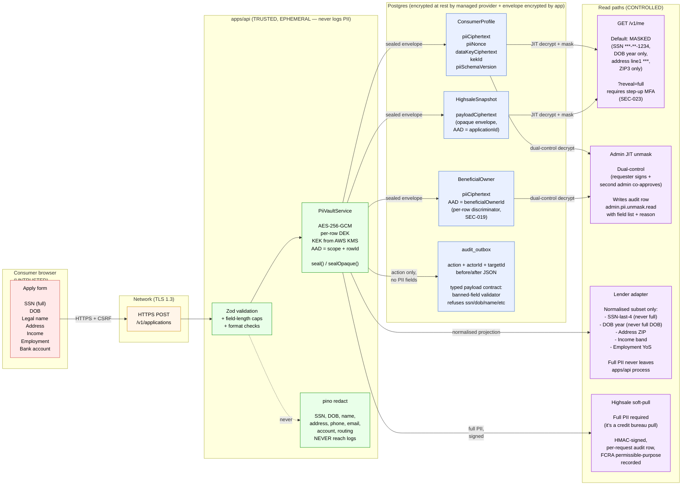

# PII data flow

Where PII enters the system, where it gets encrypted, who can read it,
and the retention boundary. Required reading for SOC 2 + any engineer
touching `ConsumerProfile`, `BeneficialOwner`, `HighsaleSnapshot`, or
any audit row.

## What's NEVER allowed

- Full SSN in any log line, anywhere, ever.
- Full PII (`legalName`, `address.line1`, `phone`, `email`) in any `audit_outbox.before/after` payload. The typed payload contract refuses these at write time (SEC-040).
- Plaintext PII in any Postgres column. Every PII field goes through `PiiVaultService.seal()` or `sealOpaque()` before insert.
- PII in URL paths or query strings. Consumer-side routing uses opaque application UUIDs only.
- PII in webhook payloads to lenders. Adapters send a normalised subset (SSN-last-4, DOB year, ZIP). Full PII goes only to Highsale (where it's needed for the bureau pull) and DocuSign (where it's needed for the loan agreement).

## Retention

| Record                                                  | Retention                                      | Why                                                               |
| ------------------------------------------------------- | ---------------------------------------------- | ----------------------------------------------------------------- |
| `ConsumerProfile.piiCiphertext` (funded loans)          | 7 years post-funding                           | Loan agreement retention. Federal + state record-keeping.         |
| `ConsumerProfile.piiCiphertext` (declined applications) | 25 months post-decline                         | FCRA Adverse Action Notice retention period (2 years + a buffer). |
| `HighsaleSnapshot.payloadCiphertext`                    | 25 months from inquiry                         | Mirrors the Adverse Action retention.                             |
| `audit_outbox` rows                                     | 7 years                                        | SOC 2 evidence + regulator query window.                          |
| Application logs (pino)                                 | 30 days                                        | Operational + incident review. PII redacted at write.             |
| OTP codes (Redis)                                       | TTL 10 minutes                                 | Only the consumer's challenge window.                             |
| Webhook payloads                                        | 90 days for delivered, 30 days for dead-letter | Operator review for failed deliveries.                            |

## Decryption — who, when, how

Three legitimate decrypt paths. Anyone else reading PII is a bug or an
incident.

1. **Consumer reads their own profile.** `GET /v1/me?reveal=full` after a fresh step-up MFA challenge captured within the last 5 minutes. Audit row: `user.pii.self_reveal`.
2. **Admin reads under dual control.** Two distinct admin sessions must approve. Requester signs (justification + field list). Second admin co-signs (timestamp + decision). Both write audit rows. Decrypt happens server-side and returns the projected fields only. Never bulk.
3. **Outbound to Highsale.** The full PII envelope is unwrapped in-memory only at the moment of the soft-pull request. The unwrapped payload goes into the HTTPS body, never to disk, never to logs, never to a queue.

## Engineer rules

If you're touching PII in code, do this:

- Never deserialize PII into a plain object that survives past the immediate request handler.
- Use `PiiVaultService` for every read AND write. Don't reach into the ciphertext columns directly.
- If you need to log a PII-bearing field, run it through the `mask()` helper in `services/user/src/internal/pii-mask.ts` first.
- If you're adding a new column that holds PII, add the field name to the banned-keys list in `services/audit/src/audit-payload.ts` AND update this diagram.
- If you're calling a new external provider, draft the AAD + the normalised subset in a PR comment BEFORE writing code. Get sign-off.
