# System topology — static component map

What service talks to what. Where the trust boundaries sit. Where PII
crosses the network. Read this after `consumer-application-flow.md` so
you can see WHERE each step happens.

```mermaid
flowchart TB
  subgraph Browsers["Browsers"]
    Applicant([Applicant])
    Operator([Operator / coach staff])
  end

  subgraph Edge["Edge — Next.js (Railway today, Vercel-ready)"]
    direction TB
    CW["consumer-web<br/>apply / processing / offers / sign"]
    PP["partner-portal<br/>master + brand portals + landings"]
  end

  subgraph APIPlane["API plane — NestJS + Fastify (apps/api on Railway)"]
    direction TB
    API["apps/api<br/>BFF + REST surface<br/>HMAC verify + JWT guard +<br/>throttler + idempotency"]
    subgraph SVCS["services/* (modular monolith)"]
      direction TB
      AUTH[services/auth<br/>JWT + OTP + TOTP +<br/>HIBP + session revoke]
      USR[services/user<br/>PiiVaultService<br/>seal/openOpaque]
      APP[services/application<br/>XState lifecycle]
      ORC[services/orchestration<br/>parallel lender fan-out<br/>+ ranking]
      LND[services/lender<br/>adapter registry +<br/>per-lender ports]
      WEB[services/webhook<br/>BullMQ per-merchant queue<br/>+ HMAC sign/verify]
      AUD[services/audit<br/>hash-chained outbox]
      PMT[services/payment<br/>disbursement +<br/>verified-bank gate]
      RSK[services/risk<br/>device + identity signals]
      CMP[services/compliance-doc<br/>AAN renderer +<br/>25mo retention]
    end
  end

  subgraph Data["Data plane"]
    direction TB
    PG[(Postgres<br/>encrypted at rest,<br/>Loan.offerId unique,<br/>audit_outbox GIN index)]
    RDS[(Redis<br/>sessions + throttler counters +<br/>OTP store)]
    BMQ["BullMQ on Redis<br/>per-merchant grouping<br/>concurrency cap = 2/merchant"]
    KMS["AWS KMS<br/>KEK rotation"]
    AUDSINK[(Hash-chained<br/>audit sink<br/>local-fs dev / DynamoDB prod)]
  end

  subgraph External["External providers"]
    direction TB
    HS[Highsale + Pixie<br/>soft pull + financial data]
    DS[DocuSign<br/>embedded e-sign]
    L1[US Bank<br/>prime-plus]
    L2[Covered<br/>coaching specialist]
    L3[Engine.Tech<br/>card-stacking, near-prime]
    L4[Queen Street<br/>prime+, large tickets]
  end

  Applicant -->|HTTPS<br/>TLS 1.3| CW
  Operator -->|HTTPS + auth cookie| PP
  CW -->|HTTPS + CSRF on writes| API
  PP -->|HTTPS + JWT| API
  API --- SVCS
  SVCS -->|Prisma over TLS| PG
  SVCS -->|ioredis| RDS
  WEB -->|BullMQ| BMQ
  USR -->|envelope KEK| KMS
  AUD -->|append-only| AUDSINK
  ORC ==>|HMAC POST<br/>5s timeout| L1
  ORC ==>|HMAC POST| L2
  ORC ==>|HMAC POST| L3
  ORC ==>|HMAC POST| L4
  ORC -->|HTTPS soft-pull| HS
  HS -.->|HMAC webhook<br/>+ replay window| API
  L1 -.->|HMAC webhook| API
  L2 -.->|HMAC webhook| API
  L3 -.->|HMAC webhook| API
  L4 -.->|HMAC webhook| API
  DS -.->|HMAC webhook| API
  APP -->|create envelope| DS

  classDef ext fill:#ffe9e9,stroke:#c44,color:#000
  classDef edge fill:#fff5e9,stroke:#c80,color:#000
  classDef data fill:#e9f0ff,stroke:#36c,color:#000
  classDef svc fill:#e9ffe9,stroke:#080,color:#000

  class HS,DS,L1,L2,L3,L4 ext
  class CW,PP edge
  class PG,RDS,BMQ,KMS,AUDSINK data
  class AUTH,USR,APP,ORC,LND,WEB,AUD,PMT,RSK,CMP svc
```

## Trust boundaries

| Boundary                                          | Crossing                                  | Protection                                                                                          |
| ------------------------------------------------- | ----------------------------------------- | --------------------------------------------------------------------------------------------------- |
| Browser → consumer-web                            | TLS 1.3                                   | HSTS preload, CSP strict, frame-ancestors none                                                      |
| consumer-web → apps/api                           | TLS + CSRF on state-changing routes       | Double-submit cookie + header echo                                                                  |
| partner-portal → apps/api                         | TLS + JWT in HttpOnly cookie              | JwtAuthGuard checks Session.revokedAt every request                                                 |
| apps/api → external (Highsale, DocuSign, lenders) | TLS + HMAC-SHA256 both directions         | 300s timestamp replay window. SSRF allowlist blocks RFC1918, 169.254/16, multicast (SEC-004)        |
| external → apps/api (webhooks)                    | TLS + HMAC-SHA256 verify                  | Constant-time compare. Idempotency key prevents replay.                                             |
| apps/api → Postgres                               | TLS + connection pool, IAM-authed in prod | Per-row PII envelope encryption (AES-256-GCM)                                                       |
| audit chain                                       | append-only, hash-linked                  | Each row's hash includes the previous row's hash. Drain ships to immutable sink (DynamoDB in prod). |

## Deployment

| Service          | Today                | Production target                                                       |
| ---------------- | -------------------- | ----------------------------------------------------------------------- |
| `consumer-web`   | Local dev            | Vercel or Railway (separate from partner-portal for blast radius)       |
| `partner-portal` | Railway (live)       | Railway or Vercel                                                       |
| `apps/api`       | Local dev            | Railway service `eazepay-api` (Dockerfile.api + railway.api.toml ready) |
| Postgres         | Local docker-compose | Railway add-on (`railway add --database postgres`) or RDS Aurora        |
| Redis            | Local docker-compose | Railway add-on (`railway add --database redis`) or ElastiCache          |
| Audit sink       | local-fs             | DynamoDB (cross-account write-only)                                     |
| KMS              | local KEK in env     | AWS KMS with auto-rotation                                              |

## Scale notes

- **Cron leader.** All 3 timed crons (webhook dispatcher, audit drain, collection scheduler) sit behind a Postgres `pg_try_advisory_lock`. Only one replica holds each lock at a time. Even if every replica has `CRON_LEADER=true` env, only one runs each cron. Belt + braces.
- **Throttler.** Three tiers (5/s, 30/10s, 120/min per IP). Counters live in Redis so the limit is fleet-wide, not per-replica.
- **Webhook dispatcher.** BullMQ queue grouped by `merchantId`, concurrency cap 2/merchant. One slow merchant cannot starve every other merchant's deliveries.
- **PII vault.** Per-row DEK wrapped by KEK. Rotating the KEK does NOT require re-encrypting every row — only the wrap. KMS-managed in production.
